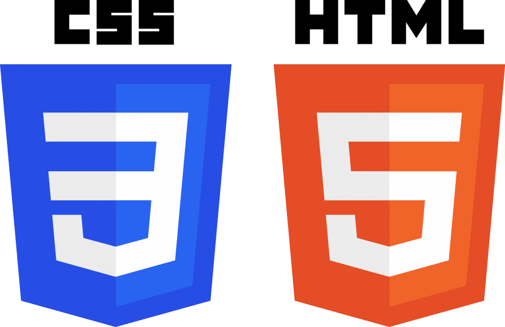
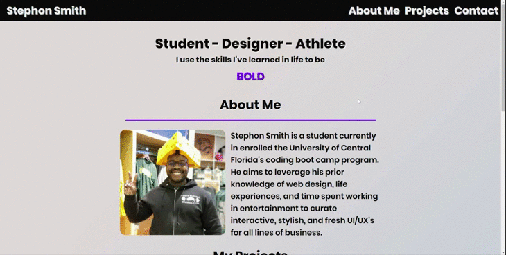
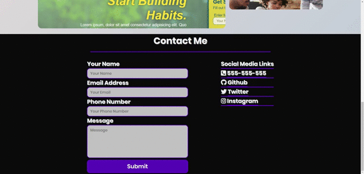
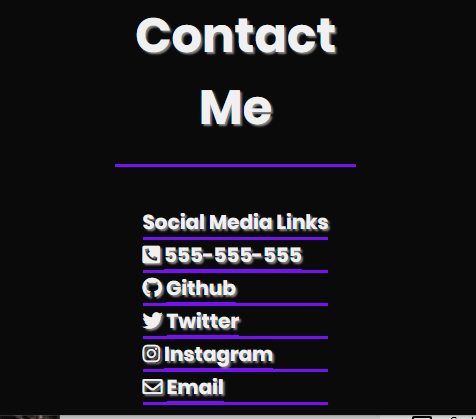
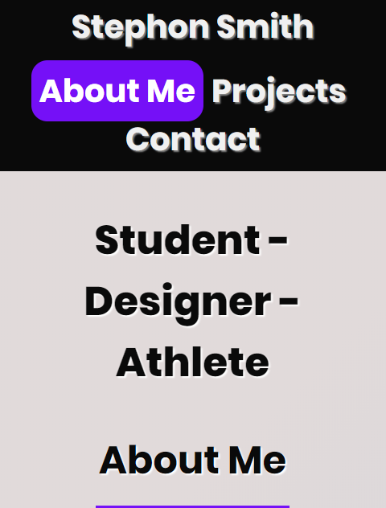
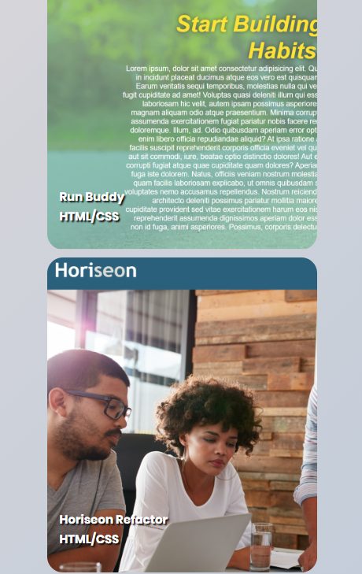

# Project-Canvas (https://smithbware89.github.io/project-canvas/)
## Description
The name "Project Canvas" is being used to encapsulate the purpose of this webpage. It's to be my canvas to showcase my journey through the University of Central Florida's coding boot camp program. I hope that as I learn new techniques that I can update this application to be more responsive, attractive, and innovative.

# Methodologies Used
- 
- ### [Word Carousel](https://codepen.io/EricPorter/pen/JjPmOOb)
- ### ["Poppins" Google Font](https://fonts.google.com/specimen/Poppins)
- ### [Gradient Background](https://www.eggradients.com/category/gray-gradient?83ff460c_page=4)
- ### [Font Awesome Icons](http://www.fontawesome.com)

# Application Features
### My projects gradient overlay

### Word Carousel

### Nav Bar Highlight

### Contacts Features

### Mobile Contacts Resizing/Form Disappear

### Mobile Hero

### Mobile Projects

