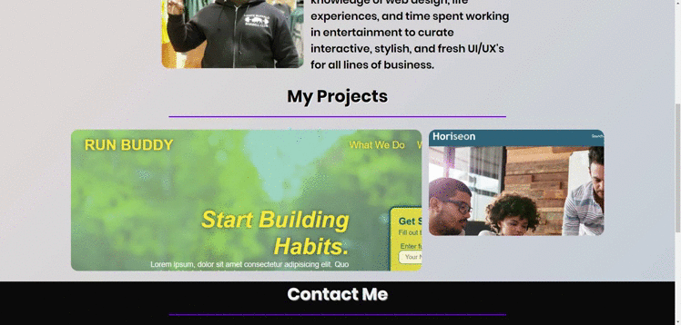
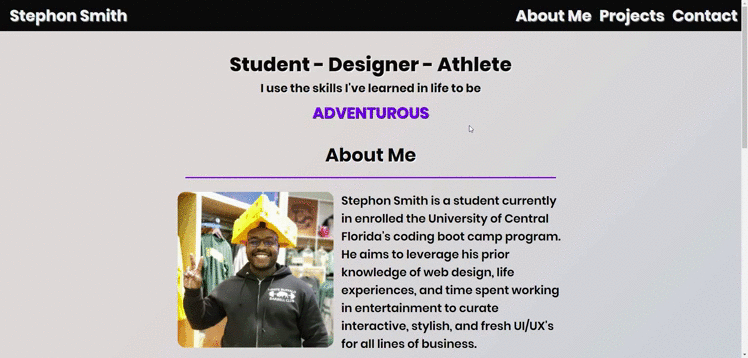
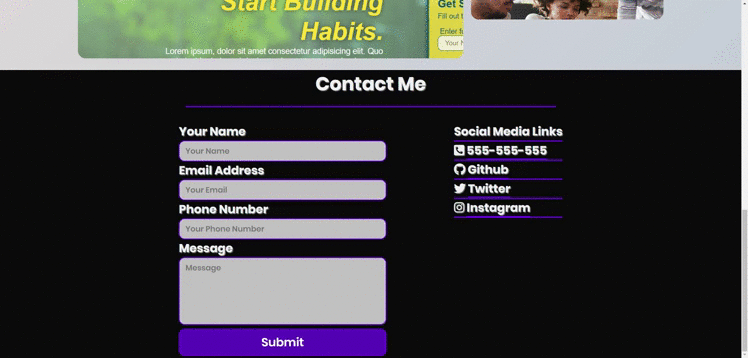

# Project-Canvas (https://smithbware89.github.io/project-canvas/)
## Description
The name "Project Canvas" is being used to encapsulate the purpose of this webpage. It's to be my canvas to showcase my journey through the University of Central Florida's coding boot camp program. I hope that as I learn new techniques that I can update this application to be more responsive, attractive, and innovative.

# Methodologies Used
- 
- ### [Word Carousel](https://codepen.io/EricPorter/pen/JjPmOOb)
- ### ["Poppins" Google Font](https://fonts.google.com/specimen/Poppins)
- ### [Gradient Background](https://www.eggradients.com/category/gray-gradient?83ff460c_page=4)
- ### [Font Awesome Icons](http://www.fontawesome.com)

# Application Features
### My projects gradient overlay

### Word Carousel

### Nav Bar Highlight

### Contacts Features

### Mobile Contacts Resizing/Form Disappear

### Mobile Hero

### Mobile Projects

# **Commit History**
##### First Commit
- Established boilerplate
- Established CSS stylesheet
- Established Readme

##### V0.1 - Initial Changes
- ~~Set background image in CSS ([Photo by Gavin Allanwood on Unsplash:](https://unsplash.com/photos/IDIbUNVmeNY))~~
- Position background image to be static (See V1 About Me)
- Imported font and set it to be font for the body of the webpage
- Established color pallette in CSS using "root" pseudo-class
- Made header into a flex navbar to allow create spacing between the links and to also ensure it will flex with resizing
- Added header resizing media queries for header

##### V0.2 - Added Hero
- Added headline with adjectives to describe who I am
- Added sub-header with animated text to show various adjectives
- Animations will loop through once upon screen load
- Disabled keyframes & animation to when under 768px screen size due to the colors not blending well with the background on mobile size
- Added word carousel

##### V0.3 - Added About Me
- Established About Me
- Created section title styles and formatted it so that it centers all text
- input about me text and centered all items
- Imported profile images to application using CSS
- Used CSS grid to format the photos so they're contained
- Used border-radius to round the corners of the images
- Unable to find text color that fit with origin background image therefore replaced with background gradient color.

##### V0.4 - Added My Projects
- Added images of both Horiseon and Run Buddy websites
- Flexed the images so that they're responsive on mobile/resizing
- Used media queries to ensure that the cards for both resize to column on smaller screen sizes with Run Buddy being the first
- Added in transition along with text/shadowing when hovering over image
- Used media queries to remove hover effects and have text standalone on image on smaller screen sizes. Also, adjusted the text size for smaller screens.
- Removed 2 additional profile photo's from About Me since they were not responsive when resizing

##### V0.5 - Contact
- Added contact form to enable e-mailing of information
- Applied styles to contact form so that it is visible and center
- Added social media links
- Added icons to distinguish social media links
- Disabled e-mail link for contact form when on larger screen sizes and set to enable on mobile.

##### V0.6 - Formatting Updates
- Removed background color from banner brand name
- Simplified class names for About Me to better format items.
- Increased font size on word carousel text
- Turned "About Me" into a flex container so that image can have bio information next to it
- Increased font size for profile text and aligned left
- Added resizing capabilities for "About Me" Section

##### V0.7 - Social Media Update
- Resized social media links so that the text is smaller when resizing
- Cleaned up HTML formatting
- Adjusted margins for sections
- Added focus pseudo class to text areas in contact section

##### V0.8 - ReadMe Images
- Added Images to GitHUb

##### V0.9 - Final ReadMe Updates
- Reformatted read me
- Added links to methodologies used in application
- Add images and gifs to ReadMe

# V1.0 - Application Launch
